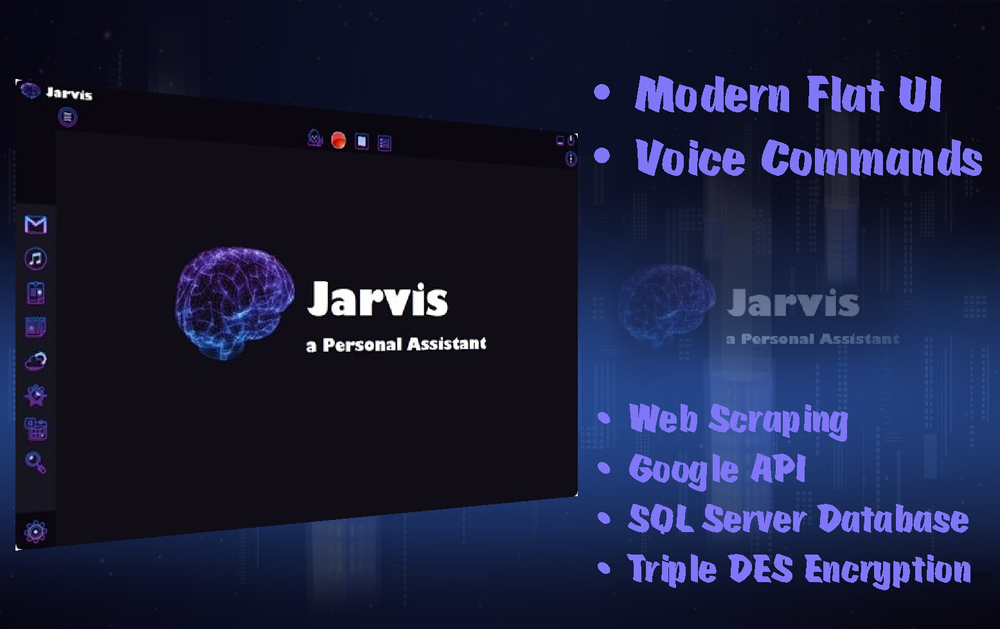

# Jarvis-a-Personal-Assistant
Jarvis, a Virtual Personal Assistant platform to perform daily tasks on behalf of the user, By using data and Internet services, controlled by voice or manual commands.

# About:
The system is built in a way that allows easy and intuitive functionality for the user, to provide the service of a personal assistant that presents a convenient and friendly interface with easy and natural operation, for the efficient and fast execution of daily tasks.

The system can provide a wide range of services for the user, including: 
  - System can connect to the e-mail account to view and read emails, ( * More info to connect Email Account on Settings Page)
  - View and read the weather forecast, ( * Set the Location on Settings Page)
  - View and read Text files directly from the user drive,
  - Update the user on the time and date news by location,
  - Search Google and read entries from Wikipedia,
  - View and read local or global news, (* Local News Source must be changed manualy in the Code)
  - Set an Alarm Clock or Timer, display and read a World Clock from major places in the world,
  - Play songs and view videos directly from the user drive,
  - Maintain a Personal Event Log containing a Calendar with public events such as holidays and special days (Defualt Jewish holiday),  and private events synchronised directly from the user's Google Calendar account.

# Technical:
  System architecture combines event-driven programming with procedural programming.
  Built based on Windows os in Visual Studio .NET environment,
  In development - Windows Forms Application, C#.

  * ML Build-in Libraries - Using NuGet to obtain machine learning tools and libraries.
  * SR Engine - Using Speech Recognition Engine to build a Grammer to absorb and decipher human speech.
  * Azure Data Base - Use a built-in database of SQL-Server, to store all information such as: voice commands, user preference information, calendar and email information.
  * Data Encryption - Using Triple DES encryption along with MD5 HF.
  * AI - Using Speech Synthesis to artificially produce human speech for communication (HCI).
  * Web scraping - Using HtmlAgilityPack to analyze HTML files from the web and extract data.
  * Google API - Using Google API to access Gmail services, as well as access Google Calendar to pull private and public events (holidays and special days) into the system's event log.
 
 

# How To Run:
  - Change the Connection String in App.config to your local string or server.
  - To activate Email reader check the Settings page in the app.
  - To use voice commands click on the button on the top, *make sure green light is on.
